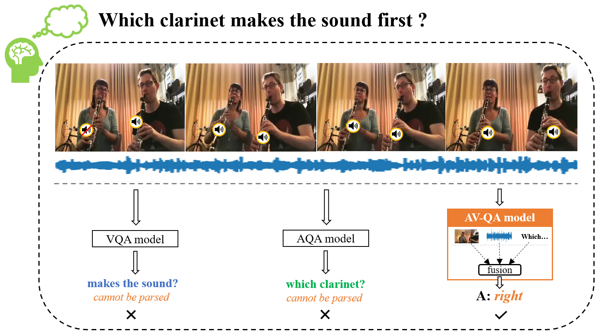
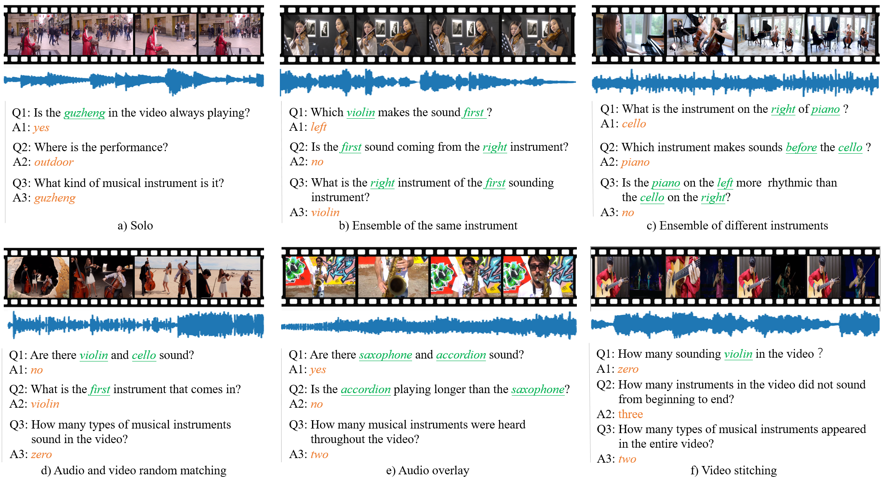
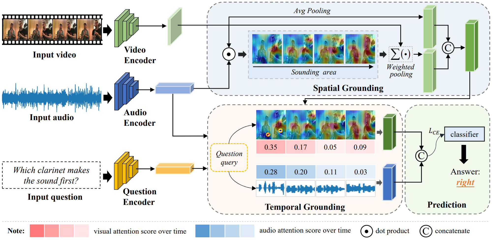
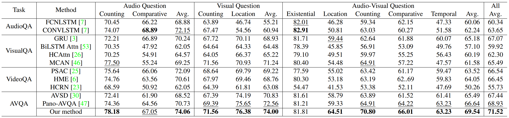
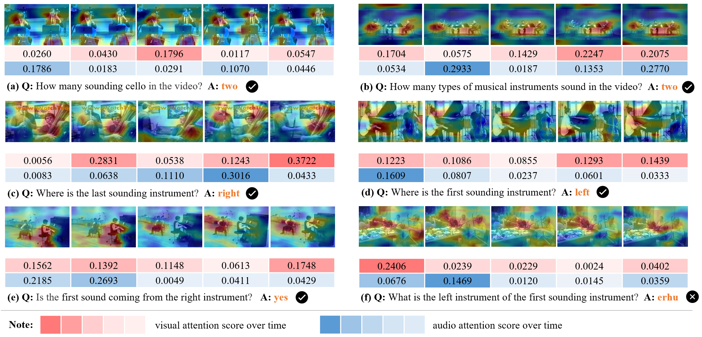
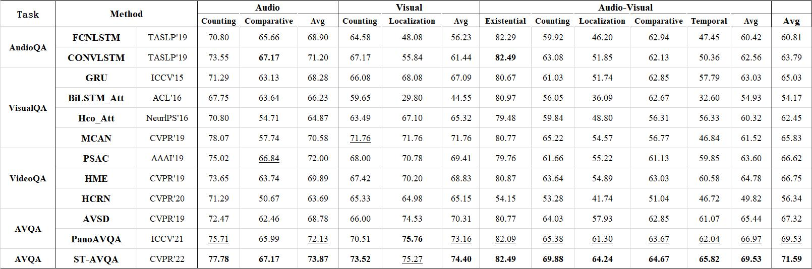

# Audio-Visual Question Answering (AVQA)

PyTorch code accompanies our CVPR 2022 paper:

**Learning to Answer Questions in Dynamic Audio-Visual Scenarios (<font color="#FF0000">Oral Presentation</font>)**

[Guangyao Li](https://ayameyao.github.io/), [Yake Wei](https://echo0409.github.io/), [Yapeng Tian](https://yapengtian.org/), [Chenliang Xu](https://www.cs.rochester.edu/~cxu22/), [Ji-Rong Wen](http://ai.ruc.edu.cn/szdw/68136712b556477db57c8ae66752768f.htm) and [Di Hu](https://dtaoo.github.io/index.html)

**Resources:**  [[Paper]](https://gewu-lab.github.io/MUSIC-AVQA/static/files/MUSIC-AVQA.pdf), [[Supplementary]](https://gewu-lab.github.io/MUSIC-AVQA/static/files/MUSIC-AVQA-supplementary.pdf),  [[Poster]](https://gewu-lab.github.io/MUSIC-AVQA/static/files/MUSIC-AVQA-poster.pdf), [[Video]](https://www.bilibili.com/video/BV1Br4y1q7YN/) 

**Project Homepage:**  [https://gewu-lab.github.io/MUSIC-AVQA/](https://gewu-lab.github.io/MUSIC-AVQA/)

---


## What's Audio-Visual Question Answering Task?

We focus on **audio-visual question answering (AVQA) task, which aims to answer questions regarding different visual objects, sounds, and their associations in videos**. The problem requires comprehensive multimodal understanding and spatio-temporal reasoning over audio-visual scenes.

<div  align="center">    

</div>


## MUSIC-AVQA Dataset

The large-scale MUSIC-AVQA dataset of musical performance, which contains **45,867 question-answer pairs**, distributed in **9,288 videos** for over 150 hours. All QA pairs types are divided into **3 modal scenarios**, which contain **9 question types** and **33 question templates**. Finally, as an open-ended problem of our AVQA tasks, all 42 kinds of answers constitute a set for selection. 

- **QA examples**

  <div  align="center">    
  
  </div>


##  Model Overview

To solve the AVQA problem, we propose a spatio-temporal grounding model to achieve scene understanding and reasoning over audio and visual modalities. An overview of the proposed framework is illustrated in below  figure.

<div  align="center">    

</div>


## Requirements

```python
python3.6 +
pytorch1.6.0
tensorboardX
ffmpeg
numpy
```


## Usage

1. **Clone this repo**

   ```python
   https://github.com/GeWu-Lab/MUSIC-AVQA_CVPR2022.git
   ```

2. **Download data**

   **Raw videos**

   - [Google Drive](https://drive.google.com/drive/folders/1WAryZZE0srLIZG8VHl22uZ3tpbGHtsrQ?usp=sharing)
   
   - Baidu Drive (**password: cvpr**)
   
     - [Real videos](https://pan.baidu.com/s/1yVPfOXyDesHdUZFHK3tYog#list/path=%2F) (36.67GB)
   
     - [Synthetic videos](https://pan.baidu.com/s/1b7HQbMdcfaWjsHdWiLWO2Q#list/path=%2F) (11.59GB)
   
   - Note
     - Please move all downloaded videos to a new folder, for example, create a new folder named MUSIC-AVQA-Videos, which contains 9,288 videos. eg., the downloaded videos will be in the `/data/video` folder. 
   
   **Annotations (QA pairs, etc.)**
   
   - Available for download at [here](https://github.com/GeWu-Lab/MUSIC-AVQA_CVPR2022/tree/main/data/json)
   - The annotation files are stored in JSON format. Each annotation file contains seven different keyword. And more detail see in [Project Homepage](https://gewu-lab.github.io/MUSIC-AVQA/)

   


3. **Data pre-processing**

   **Extract audio waveforms from videos.** The extracted audios will be in the `./data/audio` folder. `moviepy library` is used to read videos and extract audios. (**Note:** If you are going to use the audio feature files provided by us, you can ignore this step.)

   ```python
   python feat_script/extract_audio_cues/extract_audio.py	
   ```

   **Extract frames from videos.** The extracted frames will be in the `data/frames` folder. `Pandas` and `ffmpeg` libraries are required.

   ```python
   python feat_script/extract_visual_frames/extract_frames_adaptive_script.py
   ```

   We also provide the extracted frames (1fps), which can be downloaded directly from <a href="https://pan.baidu.com/s/1c9gvJrf6oGXqHVtNiuOlZQ">Baidu Drive</a> (14.84GB) (pwd: cvpr). But we thought it might be more convenient to execute the code above to extract video frames.


3. **Feature extraction** 

   **1). Audio feature.** `TensorFlow1.4` and `VGGish pretrained on AudioSet` is required. 

   ```python
   python feat_script/extract_audio_feat/audio_feature_extractor.py
   ```

   Audio feature file also can be download from [Google Drive](https://drive.google.com/file/d/1n6mEKdjA5nqAHI89HDPoxNELRa8ayIuN/view?usp=sharing) or [Baidu Drive](https://pan.baidu.com/s/1TWzuXVPncuGFIv37q5rtKg) (pwd: cvpr). VGGish feature shape: [T, 128].

   **2). 2D visual feature.** Pretrained models library is required. 

   ```python
   python feat_script/eatract_visual_feat/extract_rgb_feat.py
   ```

   Features extracted using ResNet18 also can be downloaded from [Google Drive](https://drive.google.com/file/d/1mDZRvGMJIFyYytV_1ZLsolIFbAnoUxuC/view?usp=sharing) or [Baidu Drive](https://pan.baidu.com/s/1o-QSe0HJymeXAegVRA3bPw) (972.6M). ResNet18 feature shape: [T, 512]

   **3). 14x14 visual feature.**

   ```python
   python feat_script/extract_visual_feat_14x14/extract_14x14_feat.py
   ```

   14x14 features, too large to share ... but we can extract from raw video frames.

   **4). 3D visual feature.**

   The experiments in this paper do not use 3D snippet-level features, but we have carried out some additional experiments to show that 3D snippet-level features can effectively improve the performance of the model. If you want to use 3D snippet-level features, you can generate the relevant feature file by executing the following code, which can also be downloaded from [Baidu Drive](https://pan.baidu.com/s/13Ml-Je3Mmu46OSuMfYc6vQ) (pwd: cvpr) (973.9M). R(2+1)D feature shape: [T, 512].

   ```python
   python feat_script/eatract_visual_feat/extract_3d_feat.py
   ```

   All the above feature files should be in `./data/feats` folder.

   


3. **Baseline Model**

   Training

   ```python
   python net_grd_baseline/main_qa_grd_baseline.py --mode train
   ```

   Testing

   ```python
   python net_grd_baseline/main_qa_grd_baseline.py --mode test
   ```

4. **Our Audio-Visual Spatial-Temporal Model**

   We provide trained models (path: ./net_grd_avst/avst_models/) and you can quickly test the results. Test results may vary slightly on different machines.

   ```python
   python net_grd_avst/main_avst.py --mode train \
   	--audio_dir = "path to your audio features"
   	--video_res14x14_dir = "path to your visual res14x14 features"
   ```

   Audio-Visual grounding generation

   ```python
   python grounding_gen/main_grd_gen.py
   ```

   Training

   ```python
   python net_grd_avst/main_avst.py --mode train \
   	--audio_dir = "path to your audio features"
   	--video_res14x14_dir = "path to your visual res14x14 features"
   ```

   Testing

   ```python
   python net_grd_avst/main_avst.py --mode test \
   	--audio_dir = "path to your audio features"
   	--video_res14x14_dir = "path to your visual res14x14 features"
   ```


## Results

1. **Audio-visual video question answering results** of different methods on the test set of MUSIC-AVQA. The top-2 results are highlighted. Please see the citations in the [[Paper]](https://ayameyao.github.io/MUSIC-AVQA/static/files/MUSIC-AVQA.pdf) for comparison methods.

   <div  align="center">    
   
   </div>
   
   
2. **Visualized spatio-temporal grounding results**

   We provide several visualized spatial grounding results. The heatmap indicates the location of sounding source. Through the spatial grounding results, the sounding objects are visually captured, which can facilitate the spatial reasoning.

   Firstly,  `./grounding_gen/models_grd_vis/` should be created.
   
   ```python
   python grounding_gen/main_grd_gen_vis.py
   ```
   
   <div  align="center">    
   
   </div>


## Notice
We found some minor issues in dataset annotations, which are now fixed and placed in the 'json_update' folder. The experimental results based on the updated data are as follows:

<div  align="center">    

</div>


## Citation

If you find this work useful, please consider citing it.

<pre><code>
@ARTICLE{Li2022Learning,
  title	= {Learning to Answer Questions in Dynamic Audio-Visual Scenarios},
  author	= {Guangyao li, Yake Wei, Yapeng Tian, Chenliang Xu, Ji-Rong Wen, Di Hu},
  journal	= {IEEE Conference on Computer Vision and Pattern Recognition (CVPR)},
  year	= {2022},
}
</code></pre>


## Acknowledgement

This research was supported by Public Computing Cloud, Renmin University of China.


## License

This project is released under the [GNU General Public License v3.0](https://github.com/Mukosame/Zooming-Slow-Mo-CVPR-2020/blob/master/LICENSE).


